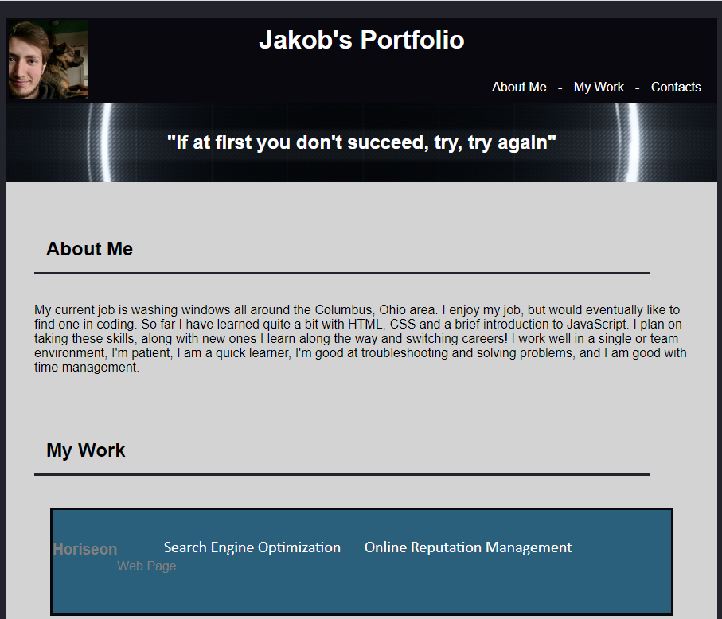

# Jakob's Portfolio

## Description

I made this as a template or potential edit for later to use as a portfolio of my work. Will be useful in job searching or even just to show people what I'm capable of! Slowly but surely learning how to become a web designer/coder.

## Usage

Just for my own personal use, to make it easier for people to see my accomplishments of coding/web design. Will update or use as a template for a later date and make it look more professional!

## Links

Live webpage: https://jdanders99.github.io/Self-Portfolio/
GitHub Repo: https://github.com/Jdanders99/Self-Portfolio

## Credits

Used https://placeholder.com/ for some of the images on the page!

## License

MIT License

Copyright (c) [2022] [Jakob Anderson]

Permission is hereby granted, free of charge, to any person obtaining a copy of this software and associated documentation files (the "Software"), to deal in the Software without restriction, including without limitation the rights to use, copy, modify, merge, publish, distribute, sublicense, and/or sell copies of the Software, and to permit persons to whom the Software is furnished to do so, subject to the following conditions:

The above copyright notice and this permission notice shall be included in all copies or substantial portions of the Software.

THE SOFTWARE IS PROVIDED "AS IS", WITHOUT WARRANTY OF ANY KIND, EXPRESS OR IMPLIED, INCLUDING BUT NOT LIMITED TO THE WARRANTIES OF MERCHANTABILITY, FITNESS FOR A PARTICULAR PURPOSE AND NONINFRINGEMENT. IN NO EVENT SHALL THE AUTHORS OR COPYRIGHT HOLDERS BE LIABLE FOR ANY CLAIM, DAMAGES OR OTHER LIABILITY, WHETHER IN AN ACTION OF CONTRACT, TORT OR OTHERWISE, ARISING FROM, OUT OF OR IN CONNECTION WITH THE SOFTWARE OR THE USE OR OTHER DEALINGS IN THE SOFTWARE.